
## Requirements for Assignment #1
[Read the instruction](https://github.com/STIW3054-A232/class-activity-stiw3054/blob/main/Assignment-1.md)

## Assessment Criteria
[Check the rubrics](https://github.com/STIW3054-A232/class-activity-stiw3054/blob/main/Rubrics-Assignment-1.md)

## Your Info:
1. 294214 MUHAMMAD AIMAN BIN NORAZLI
2. Photo
- 
3. 017409291
4. Other related info (if any)
- Semester 4 A232

## Link for the API
[Documentation for the API](https://gist.github.com/lomotech/b25cde7118adf5e7a1fea4ce6cfce259) 
[Example link of API to get data](https://www.e-solat.gov.my/index.php?r=esolatApi/takwimsolat&period=today&zone=PNG01)

## Title of your application (a unique title)
Waktu Solat Malaysia Bot - Simple Prayer Times Assistant

## Abstract (in 300 words)
### Background
The Waktu Solat Malaysia Bot is a specialized application tailored to meet the needs of the Muslim community in Malaysia by providing accurate prayer times. This bot is a result of careful design and development aimed at simplifying access to daily prayer schedules, thus eliminating the need for manual time tracking or extensive searches across multiple platforms.

### Problem Statement (from article)
The current market of prayer time applications in Malaysia is fraught with issues such as inaccuracies and non-intuitive user interfaces. These problems can lead to significant inconvenience for users, particularly when it comes to fulfilling their religious obligations. The Waktu Solat Malaysia Bot seeks to resolve these issues by delivering precise prayer times through a user-friendly interface that anyone can use with ease.

### Main Objective
The main objective of the Waktu Solat Malaysia Bot is to offer a reliable and convenient source for prayer times to Muslims living in Malaysia. It aims to simplify the process of finding out prayer times, thereby enhance the overall prayer experience for users.

### Methodology
The Waktu Solat Malaysia Bot relies on data from the official Malaysian government prayer time website, [e-solat.gov.my](https://www.e-solat.gov.my/), to provide users with the most accurate and authoritative prayer times. This direct sourcing from an official platform ensures that the prayer times are up-to-date and trustworthy.

### Result
After rigorous testing and user feedback, the Waktu Solat Malaysia Bot has proven to be highly accurate and user-friendly. It has received commendations from users for its reliability and the convenience it brings to their daily lives, particularly in helping them maintain their prayer schedule.

### Conclusion
The introduction of the Waktu Solat Malaysia Bot is a significant leap forward in the digital realm of prayer time notifications. By addressing the common issues found in other applications and focusing on user experience, the bot serves as an essential tool for Muslims in Malaysia. It simplifies the practice of observing daily prayers and supports the community in maintaining their religious commitments.

## UML Class Diagram

## JavaDoc
[Link for JavaDoc](src/main/resources/JavaDoc)

## References (Not less than 10)

1. Azamat Ordabekov. (2021, November 11). How to create Telegram Bot in Java [Video]. YouTube. [https://www.youtube.com/watch?v=XjOnp8TVNSQ](https://www.youtube.com/watch?v=XjOnp8TVNSQ)
2. bangHasans. (2020, August 31). 21 - SubMenu Keyboard (biasa) pada Bot Telegram [Video]. YouTube. [https://www.youtube.com/watch?v=-yp0eHqdgq0](https://www.youtube.com/watch?v=-yp0eHqdgq0)
3. From BotFather to “Hello World.” [https://core.telegram.org/methods](https://core.telegram.org/methods)
4. Getting started. (n.d.). [https://zaimramlan.github.io/waktu-solat-api/#documentationgetting_started](https://zaimramlan.github.io/waktu-solat-api/#documentationgetting_started)
5. Getting started | Telegram Bots. (2024, April 13). Telegram Bots Help. [https://rubenlagus.github.io/TelegramBotsDocumentation/getting-started.html](https://rubenlagus.github.io/TelegramBotsDocumentation/getting-started.html)
6. How to capitalize the first character of each word in a string. (n.d.). Stack Overflow. [https://stackoverflow.com/questions/1892765/how-to-capitalize-the-first-character-of-each-word-in-a-string](https://stackoverflow.com/questions/1892765/how-to-capitalize-the-first-character-of-each-word-in-a-string)
7. JAKIM ESolat API. (n.d.). Gist. [https://gist.github.com/lomotech/b25cde7118adf5e7a1fea4ce6cfce259](https://gist.github.com/lomotech/b25cde7118adf5e7a1fea4ce6cfce259)
8. OpenAI. (2024). ChatGPT [Large language model]. [https://chat.openai.com/chat](https://chat.openai.com/chat)
9. pengrad/java-telegram-bot-api: Telegram Bot API for Java. (2024, April 14). GitHub. [https://github.com/pengrad/java-telegram-bot-api](https://github.com/pengrad/java-telegram-bot-api)
10. Portal e-Solat. (n.d.). [https://www.e-solat.gov.my/](https://www.e-solat.gov.my/)
11. Telegram Bot API. (n.d.). [https://core.telegram.org/bots/api#replykeyboardremove](https://core.telegram.org/bots/api#replykeyboardremove)
12. zaimramlan/waktu-solat-api: Malaysia Waktu Solat JSON API (E-Solat API). Data from JAKIM’s E-Solat. (2021, March 21). GitHub. [https://github.com/zaimramlan/waktu-solat-api](https://github.com/zaimramlan/waktu-solat-api)

## Youtube Presentation
[Link for Youtube Presentation](https://youtu.be/t3tScCBq1Dc)

## Result/Output (Screenshot of the output)
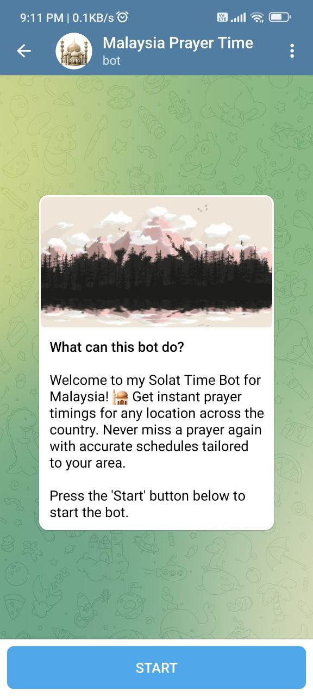 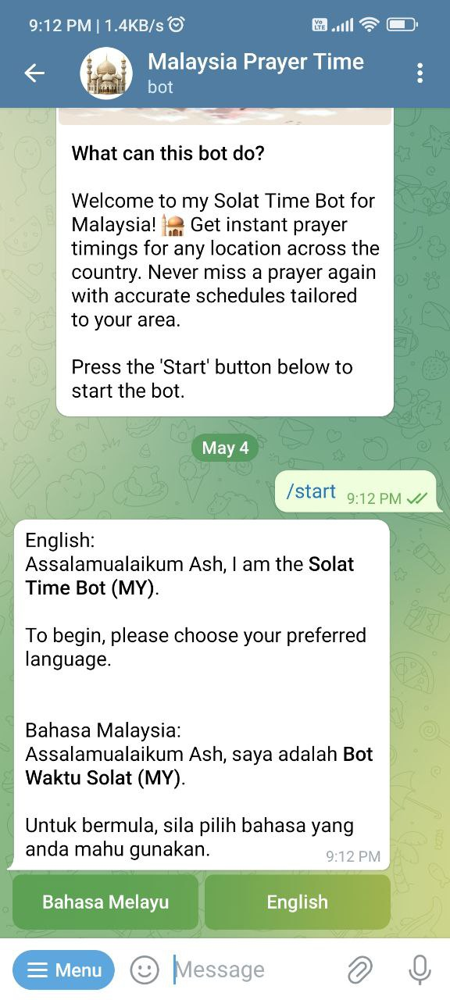 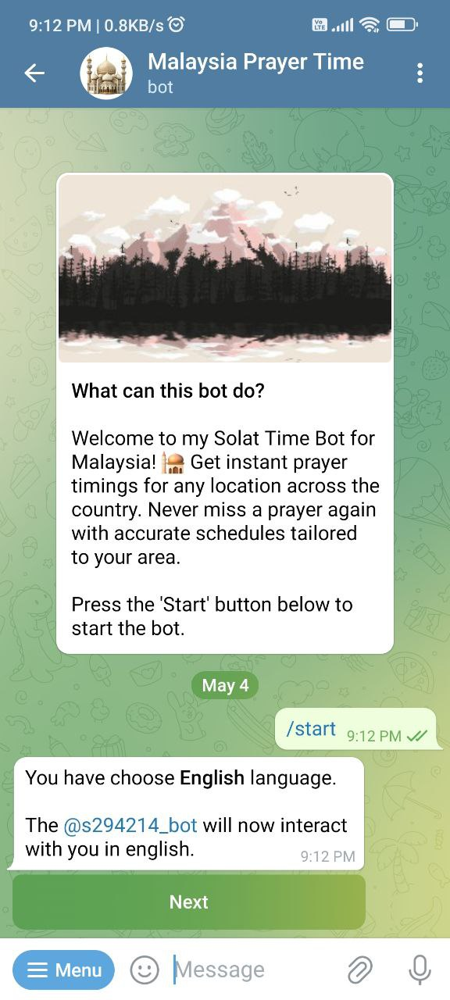 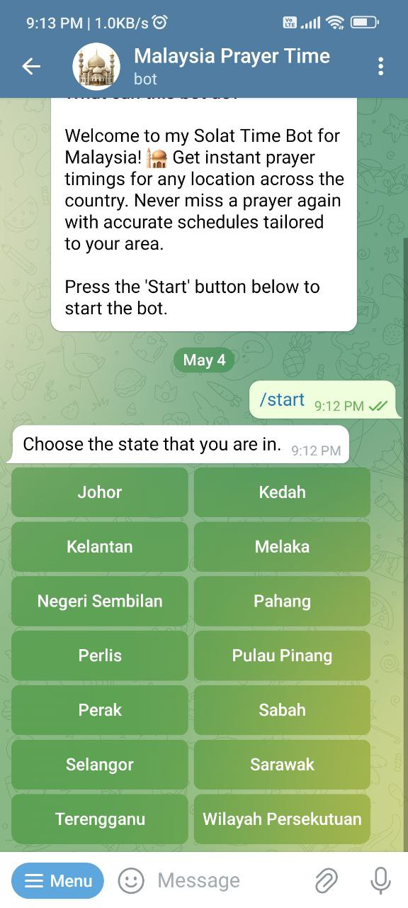 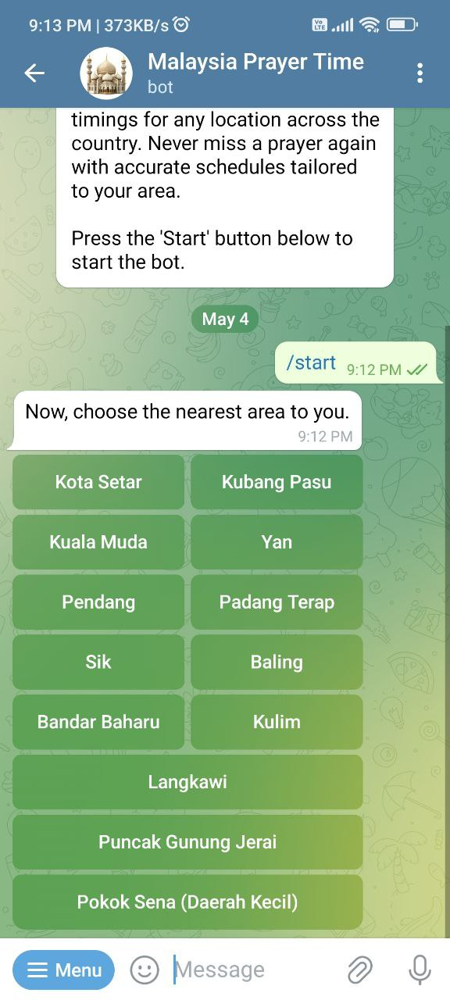 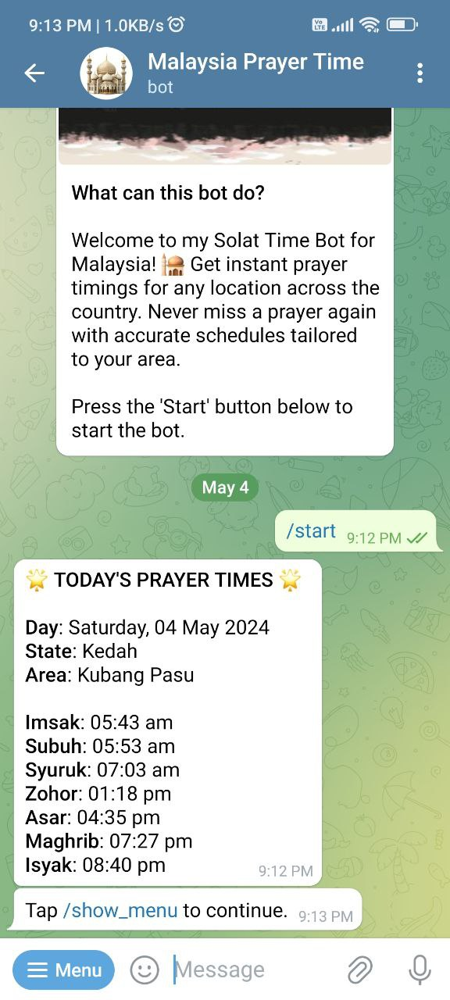 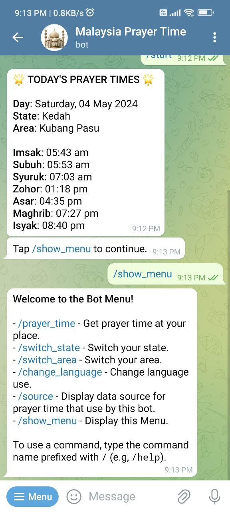 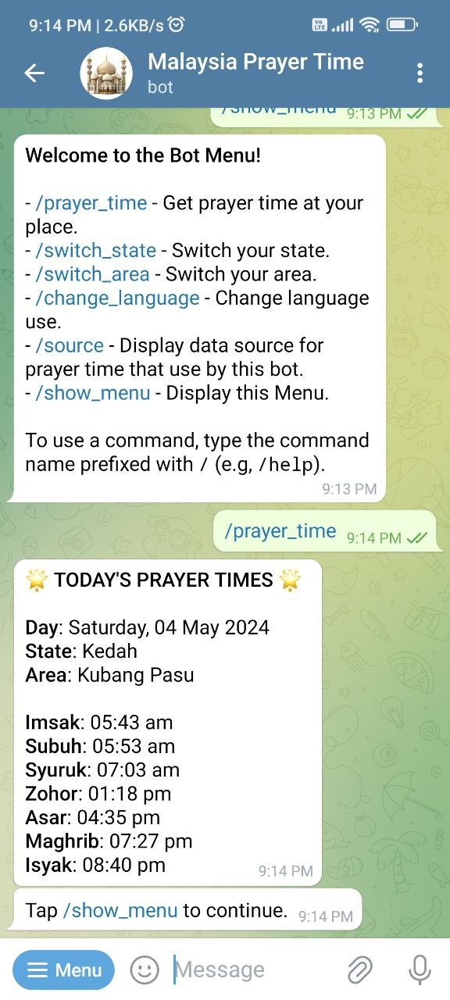 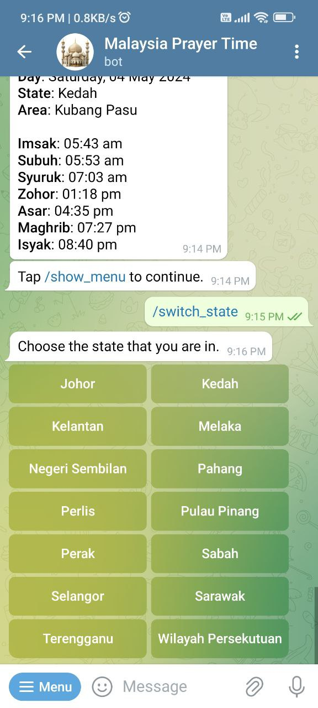 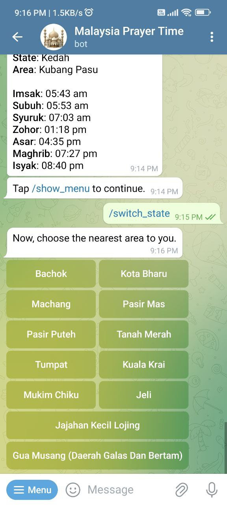 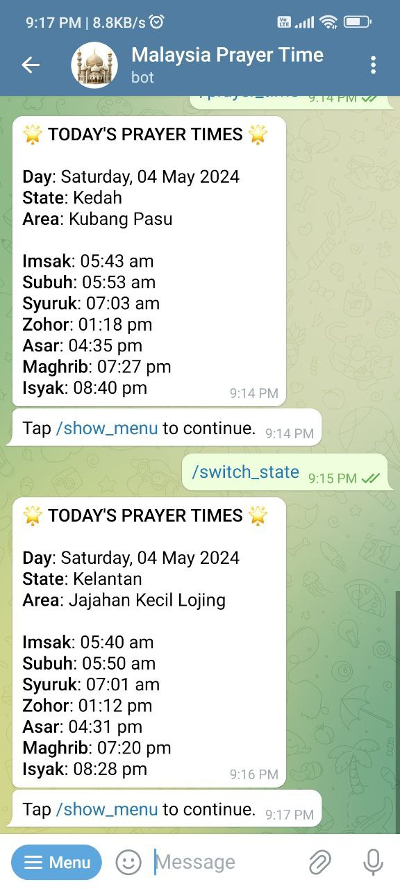 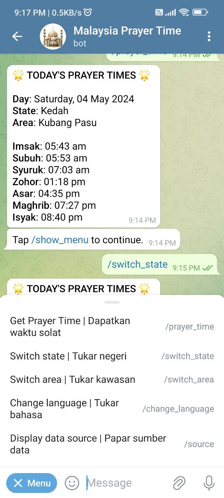 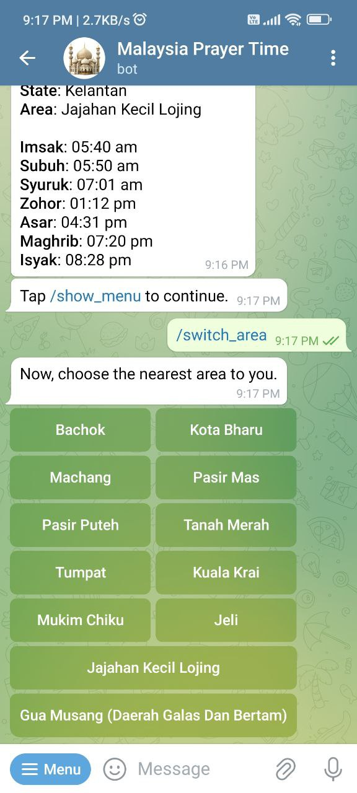 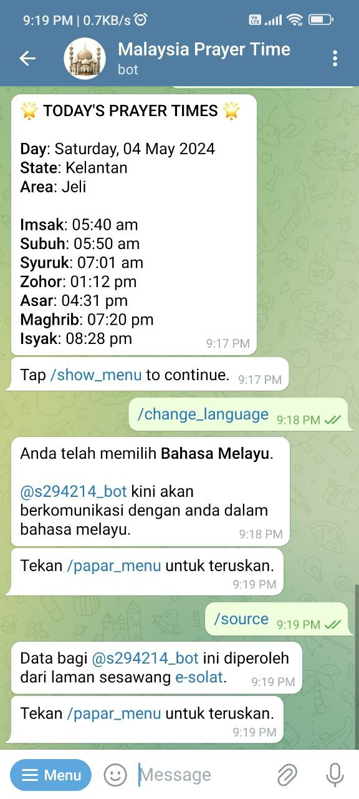 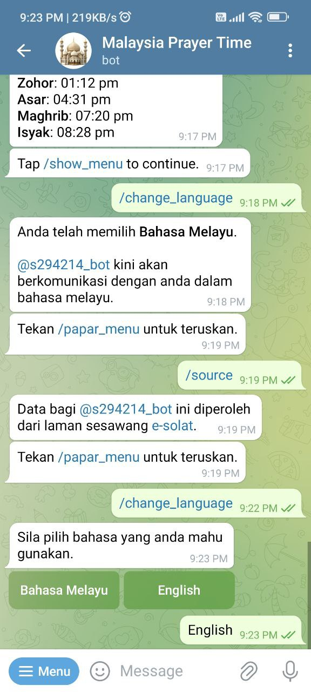 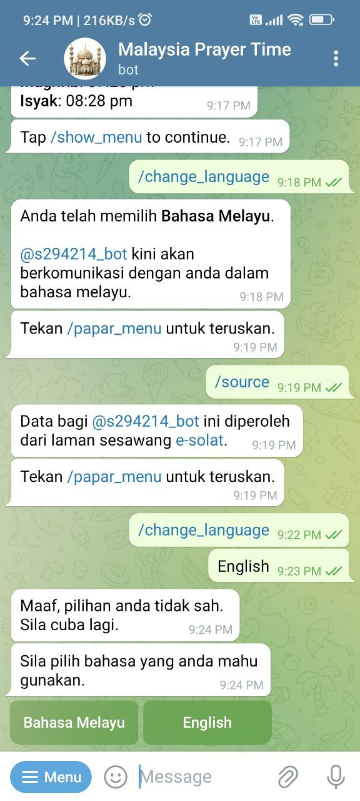
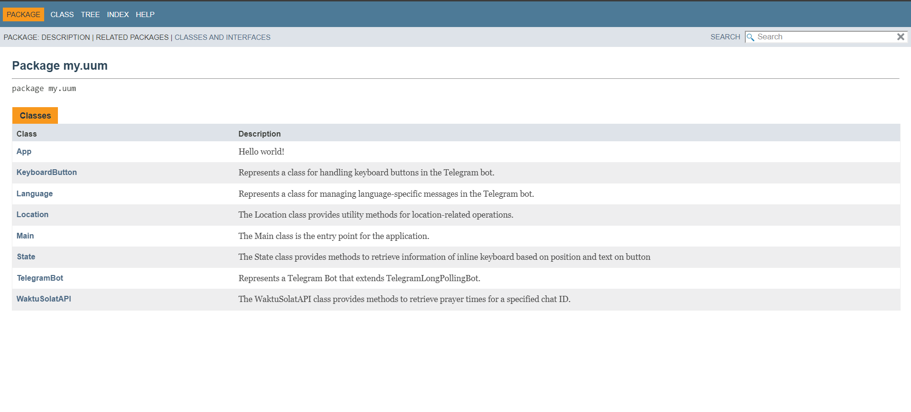
 

